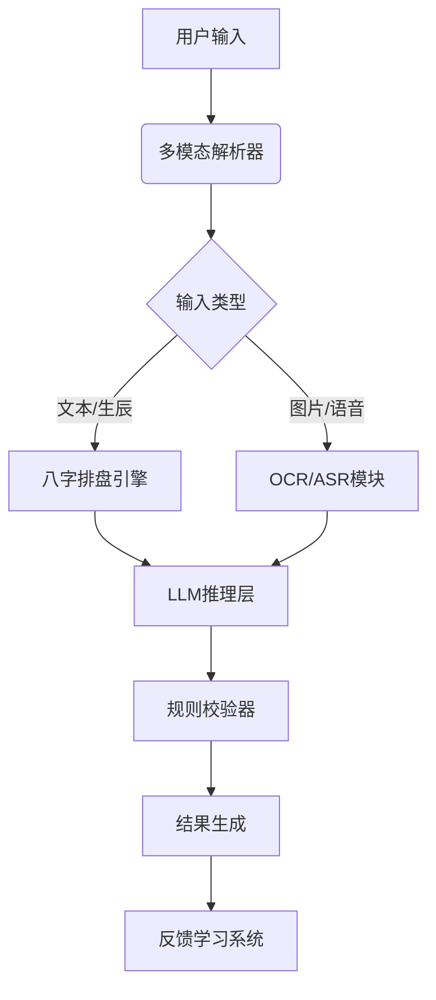

# AI算命

### 一、项目可行性分析

#### 1. **市场需求**
- **用户基础**：玄学、星座、命理类应用在年轻群体（尤其18-35岁）中需求旺盛，具备娱乐化、社交化和轻量化特征。国内类似产品（如测测星座、准了）月活可达百万级。
- **差异化机会**：传统算命App多依赖固定规则库，大语言模型（LLM）可提供更灵活、个性化的解读，结合用户实时反馈优化结果，具备技术护城河。
- **政策风险**：需规避"封建迷信"红线，建议定位为"传统文化趣味解读"或"人生决策参考工具"，避开直接因果断言。

#### 2. **技术可行性**
- **知识融合**：将八字/紫微斗数规则库转化为结构化提示词（prompt engineering），结合用户行为数据动态调整输出风格（如"理性分析型"或"心灵治愈型"）。
- **模型选择**：推荐使用微调后的**Llama3-8B**（开源可商用）或**Qwen-7B**（中文优化），配合RAG技术接入《三命通会》等典籍库提升专业感。
- **合规设计**：对话中强制插入"娱乐建议仅供参考"免责声明，建立敏感词过滤系统（如疾病、投资建议等）。

---

### 二、技术栈方案

#### 1. **核心架构**

#### 2. **关键技术点**
- **领域微调**：使用LoRA技术对基础模型进行轻量化微调，训练数据需包含：
  - 10万+传统命理典籍结构化段落
  - 5万+真实用户咨询对话（需脱敏）
  - 3万+人工标注的"安全回答"样本
- **动态命盘**：开发Python版紫微斗数排盘引擎，支持真太阳时、节气修正等专业功能
- **反脆弱设计**：部署多个并行模型（如专业版/娱乐版），根据用户设备信息自动选择输出风格

---

### 三、运营推广策略

#### 1. **冷启动阶段**
- **种子用户获取**：在B站/小红书发起"AI算命VS传统师傅"挑战赛，邀请命理博主测评
- **裂变机制**：设计"命理报告解锁码"系统，分享3位好友可获得完整版解读
- **数据飞轮**：用户反馈的"准/不准"评价直接进入强化学习系统，每周更新模型版本

#### 2. **商业化路径**
| 阶段    | 主要策略                          | ARPU目标   |
|---------|---------------------------------|-----------|
| 0-3月   | 广告变现（开屏/信息流）            | ¥0.8-1.2  |
| 3-6月   | 会员订阅（每日运势+年度命书）       | ¥15-30/月 |
| 6月+    | B端合作（与珠宝/寺庙联名开运商品） | ¥50+      |

#### 3. **合规运营**
- 建立三级内容审核机制：自动过滤（关键词库）→AI审核（bert分类模型）→人工抽查
- 支付环节使用"虚拟服务-文化咨询"类目，避免使用"算命"等敏感表述
- 香港/新加坡主体上架App Store，境内通过小程序分发

---

### 四、预期财务模型（12个月）

| 指标         | 乐观预估    | 保守预估    |
|--------------|------------|------------|
| MAU          | 80万       | 30万       |
| 付费转化率    | 5%         | 2%         |
| 月营收        | ¥120万     | ¥36万      |
| 主要成本      | 云服务/审核 | 人力/合规  |
| 净利润率      | 35%        | 15%        |

---

### 五、关键风险与对策

1. **政策风险**
   - 预备多套UI方案（如政策收紧时切换为"人生决策助手"模式）
   - 建立应急响应机制，确保2小时内可下线敏感功能

2. **模型幻觉**
   - 开发"命理规则校验器"中间件，强制输出符合子平法的结论
   - 设置输出置信度提示（如"本次解读参考了3个流派理论"）

3. **用户留存**
   - 设计"命盘成长系统"，用户连续登录可解锁前世故事等娱乐内容
   - 每周推出限时主题（求职季特别占卜、情人节姻缘分析）

建议优先开发微信小程序试水（无需安装、传播快），模型端可先用GPT-4 API快速验证（需配合本地规则引擎确保合规），待模式跑通后再迁移至私有化模型。注意收集用户对话数据时需符合《个人信息保护法》要求，建议设置7天自动删除机制。