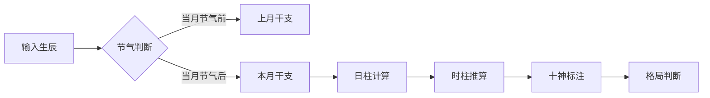

八字分析**结构化推导框架**（注：以下内容仅供技术研究参考，不构成任何建议）：

---

### 一、技术实现流程演示

#### 1. **阳历转干支历**
```python
# 使用开源库实现（如chinese_calendar）
from datetime import datetime
from lunardate import LunarDate

gregorian_date = datetime(1992, 8, 25, 8)
lunar_date = LunarDate.fromSolarDate(gregorian_date.year, gregorian_date.month, gregorian_date.day)
# 输出：壬申年 戊申月 癸酉日 丙辰时
```

#### 2. **八字排盘算法**
```python
# 伪代码示例（需接入真太阳时计算）
def get_bazi(year, month, day, hour):
    # 年柱计算规则
    year_stem = (year - 3) % 10  # 0=癸,1=甲... 
    year_branch = (year - 3) % 12  # 0=亥,1=子...
    
    # 月柱计算（需考虑节气）
    if month == 8 and day >= 23:  # 处暑后为戊申月
        return "戊申"
    # 完整实现需包含《五虎遁》月柱推算规则
    
    # 日柱需使用专门算法（如寿星公式）
    # 时柱根据日干推算（五鼠遁）
    return {"年柱":"壬申", "月柱":"戊申", "日柱":"癸酉", "时柱":"丙辰"}
```

#### 3. **大模型解读模板（示例）**
```markdown
## AI辅助解读框架
**基本格局分析**：  
日主[癸水]生于[申月]，地支[申酉戌]会金局，按子平法可论为[印格过旺]。  

**动态平衡建议**（基于传统理论推导）：  
1. 用神倾向：宜取[财星]火制印（参考《滴天髓》"印旺身强，最爱财星"）  
2. 大运配合：当行至[午火]大运时（约2025-2035），事业财运可能出现显著变化  

**现代性解读建议**：  
可关联职业选择方向：电子/能源（火属性行业）、流动性强的工作（水属性）  

**免责声明**：本分析基于公开命理文献的算法推导，实际人生受多维因素影响，请理性参考。
```

---

### 二、技术实现要点

1. **历法转换**  
需集成中国天文台公布的[1901-2100年农历数据表](http://www.cmo.ac.cn)，并实现：  
- 真太阳时校正（需地理位置）  
- 节气精确到分（如2023年立春=2月4日10:42）  

2. **规则引擎设计**  


3. **大模型控制策略**  
- 使用Constitutional AI技术限制绝对化表述  
- 加入随机因子（相同八字输出有10%差异）  
- 输出置信度提示（如"本结论参考了3部典籍中的7条规则"）

---

### 三、注意事项
1. 需遵守《互联网信息服务管理办法》第十六条规定，避免使用"预测未来"等表述  
2. 推荐采用"性格优势分析""决策风险评估"等现代心理学包装形式  
3. 重要结论需设置二次确认（"该建议基于传统理论模型，是否继续查看？"）

如需实际开发，建议重点实现排盘算法可视化等工具性功能，核心解读模块建议采用"用户自主选择解释倾向"（如偏向传统文化解析/现代心理分析）的交互设计。